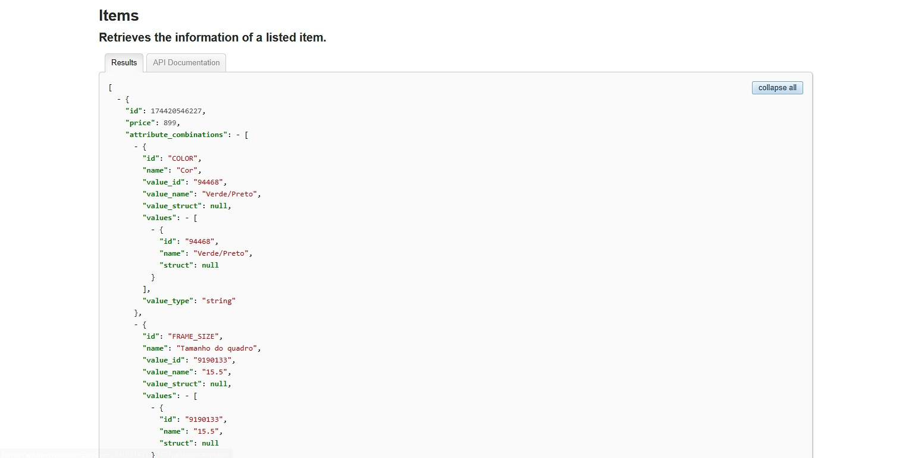
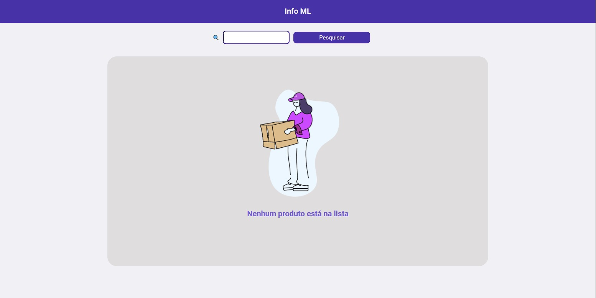
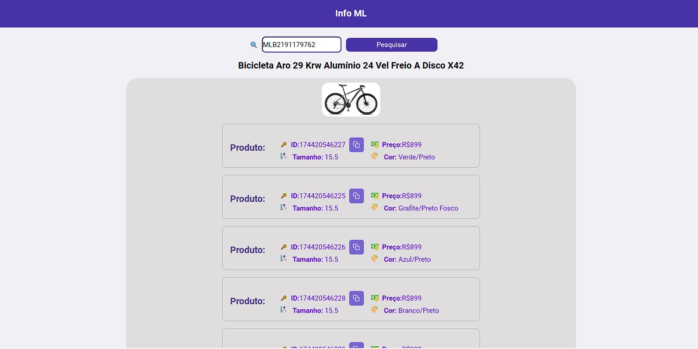

# Mercado Livre Variações

# 💻Projeto
Essa aplicação foi criada para trazer todas as informações de variações de um produto do Mercado Livre.

-  Essas informações são muito util para vendedores do e-commerce porque caso eles desejem integrar seus produtos e esses produtos possuirem variações é necessário de pelo menos o ID dessas variações, e para encontrar essas variações é possível encontrar pela própria API do Mercado Livre. Mas o problema é que para usuários que não tem conhecimento com esses códigos tem uma certa dificuldadpara extrair as informações da API e até mesmo a para quem entende acaba sendo uma tarefa demorada de encontrar o que estão buscando.

- Agora com a aplicação a identificação dos códigos de variações acaba sendo mais fácil por conta de que é feito um filtro das informações e trazendo apenas as informações necessárias.

- Para fazer uma busca do produto que deseja só é preciso do código do produto que se encontra na própria URL do produto que se encontra no exemplo abaixo:
- Código do Produto: MLB-2191179762

https://produto.mercadolivre.com.br/<b>MLB-2191179762</b>-bicicleta-aro-29-krw-aluminio-24-vel-freio-a-disco-x42-_JM?attributes=FRAME_SIZE%3AMTUuNQ%3D%3D&quantity=1

# 🚀Tecnologias
API:
- Mercado Livre API

Ferramentas Utilizadas:
- React.js
- JavaScript

Bibliotecas:
- Axios
- Lottie
